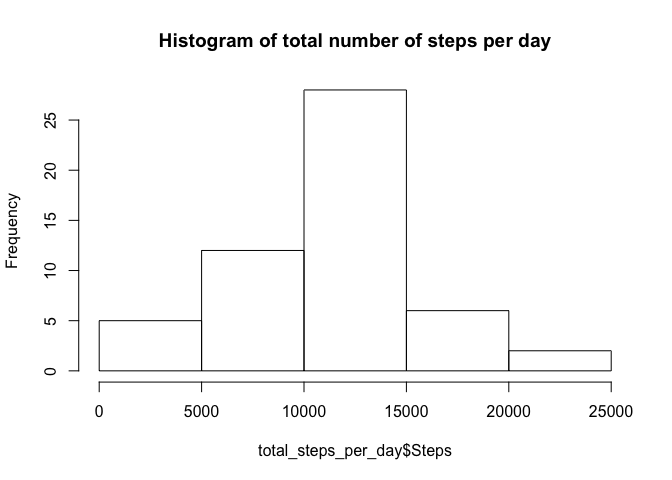
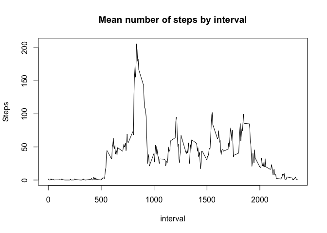
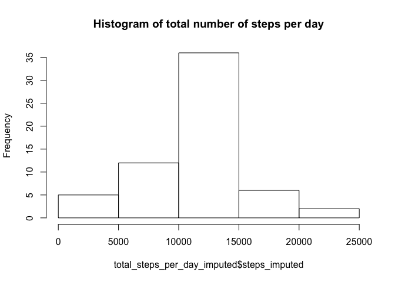
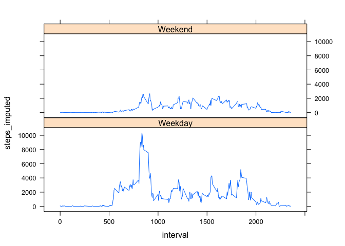

# Reproducible Research: Peer Assessment 1


```r
# ensure reproducability of results
set.seed(1)
```

## Loading and preprocessing the data

Load the data and create a timestamp field:


```r
unzip('activity.zip')

activity <- read.csv(file = 'activity.csv',
                header = TRUE,
                sep = ",")

activity$date <- as.Date(activity$date)

activity$hour   <- sprintf('%02d', activity$interval %/% 100)
activity$minute <- sprintf('%02d', activity$interval %% 100)

activity$ts <- as.POSIXct(
                    paste(
                        activity$date, ' ', 
                        activity$hour, ':', 
                        activity$minute,
                        sep = ''))

# get the number of days since January 1, 1970
activity$day_id <- as.integer(activity$date)

activity$weekday <- factor(
                      weekdays(activity$date),
                      levels= c("Sunday", "Monday", "Tuesday", 
                                "Wednesday", "Thursday", "Friday", 
                                "Saturday"))
```

## What is mean total number of steps taken per day?

The total number of steps taken per day:


```r
library(dplyr,  warn.conflicts = FALSE)

# calculate the aggregates
total_steps_per_day <- activity %>% 
  group_by(day_id) %>% 
  summarise(
    Steps  = sum(steps, na.rm = TRUE),
    Num.Records = sum(!is.na(steps))
    )

# remove invalid records
total_steps_per_day <-
  filter(total_steps_per_day, Num.Records > 0)
```

Histogram of the total number of steps taken each day


```r
hist(total_steps_per_day$Steps, 
     main = "Histogram of total number of steps per day")
```

<!-- -->

Mean and median of the total number of steps taken per day


```r
mean_steps_per_day <- mean(total_steps_per_day$Steps)
median_steps_per_day <- median(total_steps_per_day$Steps)
```

The mean of the total number of steps taken per day is 
  10766.

The median of the total number of steps taken per day is 
  10765.


## What is the average daily activity pattern?


```r
library(dplyr,  warn.conflicts = FALSE)

# calculate the aggregates
average_daily_activity_pattern <- activity %>% 
  group_by(interval) %>% 
  summarise(
    Steps  = mean(steps, na.rm = TRUE),
    Num.Records = sum(!is.na(steps))
    )
```

Plot the mean number of steps by interval


```r
with(average_daily_activity_pattern,  
     plot(Steps ~ interval, type='l', main='Mean number of steps by interval'))
```

<!-- -->

Now find the interval contains the maximum number of steps.


```r
interval_with_max_mean_steps <- average_daily_activity_pattern %>%
            filter(Steps == max(Steps))
```

The interval with maximum number of steps is 835.

## Imputing missing values

Calculate and report the total number of missing values in the dataset (i.e. the total number of rows with NAs)


```r
total_number_missing_values <- sum(is.na(activity$steps))
```

Total number of missing values in the dataset is 2304.

We will use a strategy of populating missing values using the mean number of steps for the interval.  

We can create a new dataset that is equal to the original dataset but with the missing data filled in.


```r
activity_imputed <- merge(activity,  average_daily_activity_pattern, by = 'interval')

activity_imputed$Steps <- as.integer(round(activity_imputed$Steps))

# steps = actual steps
# Steps = mean steps
activity_imputed$steps_imputed <- 
  with(activity_imputed, 
      ifelse(is.na(steps), Steps, steps)
   )

total_steps_per_day_imputed <- activity_imputed %>% 
  group_by(day_id) %>% 
  summarise(
    steps_imputed = sum(steps_imputed)
    )
```

Make a histogram of the total number of steps taken each day


```r
hist(total_steps_per_day_imputed$steps_imputed, 
     main = "Histogram of total number of steps per day")
```

<!-- -->

Calculate and report the mean and median total number of steps taken per day. Do these values differ from the estimates from the first part of the assignment? 


```r
mean_steps_per_day_imputed <- mean(total_steps_per_day_imputed$steps_imputed)
median_steps_per_day_imputed <- median(total_steps_per_day_imputed$steps_imputed)
```

The mean of the total number of steps taken per day is 
  10766.

The median of the total number of steps taken per day is 
  10762.

What is the impact of imputing missing data on the estimates of the total daily number of steps?

There is a very small difference in the estimates when missing step counts are imputed.  The effect of missing values on this dataset are negligible.

## Are there differences in activity patterns between weekdays and weekends?

For this part the weekdays() function may be of some help here. Use the dataset with the filled-in missing values for this part.

Create a new factor variable in the dataset with two levels – “weekday” and “weekend” indicating whether a given date is a weekday or weekend day.


```r
activity_imputed$weekday_or_weekend <- 
    factor(ifelse(activity_imputed$weekday %in% c('Saturday', 'Sunday'), 'Weekend', 'Weekday')) 
```
    
Make a panel plot containing a time series plot (i.e. type = "l") of the 5-minute interval (x-axis) and the average number of steps taken, averaged across all weekday days or weekend days (y-axis).


```r
total_steps_per_day_imputed <- activity_imputed %>% 
  group_by(interval, weekday_or_weekend) %>% 
  summarise(
    steps_imputed = sum(steps_imputed)
    )

library(lattice)
xyplot(steps_imputed~interval|weekday_or_weekend,data=total_steps_per_day_imputed,type="l",layout=c(1,2))
```

<!-- -->
